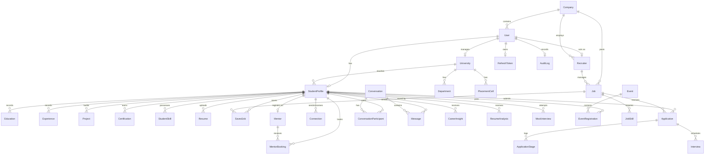

# CareerBridge Database Architecture & Entity Relationship Diagram (ERD)

This document details the refined database architecture implemented for the CareerBridge SaaS platform.

---

## 1. Entity Relationship Diagram (Mermaid ERD)

---

## 2. Core Entities & Design Decisions

### A. Authentication & User Profile
- **`User`**: Primary login entity. Holds password hash, role (`UserRole`), verification status, and soft-delete parameters (`isDeleted`, `deletedAt`).
- **`RefreshToken`**: Session tracking tokens to allow rolling authentication in client web apps.

### B. Company Organization Hierarchy
- **`Company`**: The root organization for recruiters and employers.
- **`User` (with `companyId`)**: Allows multi-user corporate login.
- **`Recruiter`**: Links a corporate User account to a specific Company.
- **`Job`**: Associated directly with the Company and posted/managed by a specific Recruiter.

### C. Student Portfolio & Profiles
- **`StudentProfile`**: Maps 1-to-1 with a Student User.
- **`Education`, `Experience`, `Project`, `Certification`**: Form standard normalized child tables of the Student Profile to enable flexible editing.
- **`StudentSkill` & `Skill`**: N:M junction table to record student competencies.

### D. Application Workflow
- **`Application`**: Relates `StudentProfile` N:1 to `Job`.
- **`ApplicationStage`**: Transactional logs tracking milestones (e.g. screening, review, hr round).
- **`Interview`**: Associated with applications to store scheduling details.

### E. AI Services Data Architecture
- **`CareerInsight`, `ResumeAnalysis`, `MockInterviewReport`**: Keep AI evaluations lightweight by saving overall scores, summaries, metadata models, and version tags. Heavy generated logs can reside in external storage and be referenced here.

---

## 3. Index Configurations

To ensure sub-millisecond query execution, indexes are created on:
1. **Email / Username**: `User.email` index.
2. **Soft Deletes**: To enable rapid filtering of deleted rows.
3. **Application Status**: `Application.status` index.
4. **Scheduled Events & Interviews**: `Interview.scheduledAt` and `Event.scheduledAt`.
5. **Message Timing**: `Message.createdAt` and `Message.conversationId` for chat feeds.
